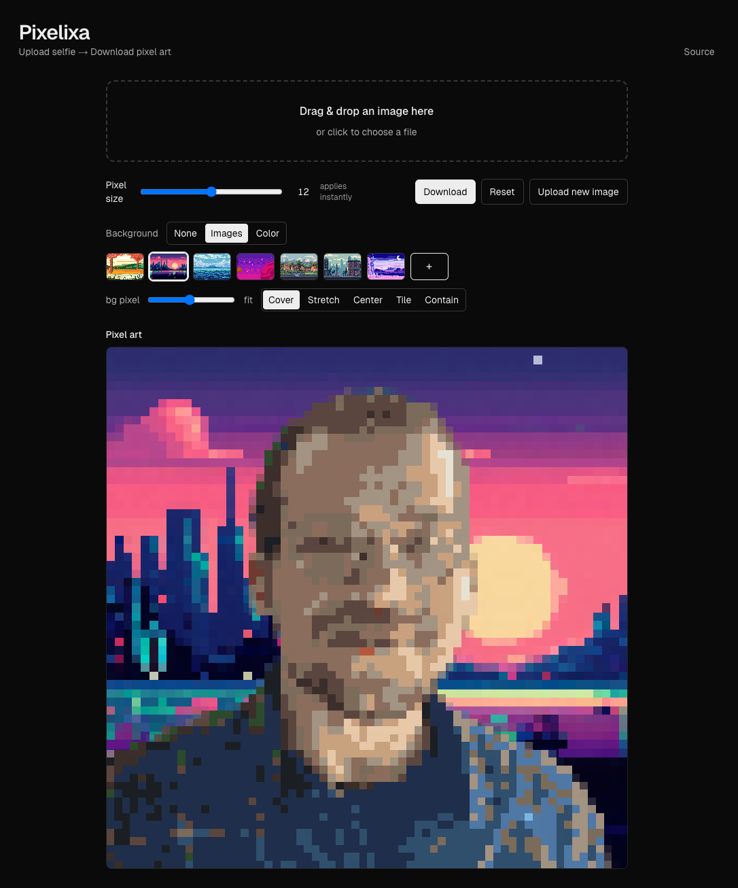

<details open>
  <summary><strong>English</strong></summary>

# Pixelixa — Background removal to pixel art (client‑side)



Pixelixa is a modern, client‑side web app that turns your selfies (or any photo) into cozy pixel‑art. It removes the background in the browser, lets you compose with pixel‑art backgrounds or solid colors, adds optional mild background pixelation, and exports as PNG (with transparency preserved when background is None).

## Highlights

- Client‑side only: no image leaves your device
- Background removal powered by `@imgly/background-removal`
- Subject pixelation with palette quantization for a Stardew‑like look
- Background modes: None (transparent), Images (gallery + your uploads), Color
- Background fit modes: cover, stretch, center, tile, contain
- Mild background pixelation amount (independent of subject pixel size)
- Instant updates: controls apply immediately
- Download as PNG

## Quick start

```bash
npm install
npm run dev
# open http://localhost:3000 (or the port shown in console)
```

## How to use

1. Drag & drop an image or click the upload area.
2. Wait for “Processing…” with the spinner to complete.
3. Tune results:
   - Pixel size: subject pixels (updates instantly)
   - Background: None / Images / Color
     - Images: choose a gallery image, or click the + tile to add your own
     - Color: pick a solid background color
   - bg pixel: mild pixelation for the background (subtle retro feel)
   - fit (Images mode): cover, stretch, center, tile, contain
4. Click Download (top right) to save as PNG.

## Controls reference

- Pixel size: 6–18; higher = chunkier subject pixels
- Background modes:
  - None: transparent canvas (PNG preserves alpha)
  - Images: pick from gallery or add your own via the + tile
  - Color: choose any color; fit options are hidden in Color/None
- bg pixel: 1–24; subtle background pixelation. 10 is the default
- fit (Images): how the background image is placed
  - cover: fill and crop if necessary
  - stretch: fill without preserving aspect
  - center: natural size, centered
  - tile: repeat pattern
  - contain: letterbox to keep full image

## Tips

- Download uses PNG to keep transparency (None mode)
- If you switch to Images and nothing selected yet, the first gallery item is auto‑selected
- “Upload new image” clears the current result then opens a file picker
- Reset returns to sensible defaults (None background, bg pixel 10, fit cover)

## Tech stack

- Next.js (App Router), React, TypeScript, Tailwind CSS
- `@imgly/background-removal` for on‑device background removal
- Canvas for pixelation & composition

## Develop & build

```bash
# install deps
npm install

# start dev server
npm run dev

# production build
npm run build
npm run start
```

## Project structure (key parts)

```
src/
  app/
    page.tsx           # renders AppClient
  components/
    AppClient.tsx      # orchestrator UI (client)
    Uploader.tsx       # drag & drop + file input
    Controls.tsx       # pixel size control (instant)
    BackgroundGallery.tsx # gallery with + tile upload
    Preview.tsx        # image preview
  lib/
    image/
      pixelate.ts      # pixelation + quantization
      background.ts    # compose with bg (fit, mild pixelation)
public/
  backgrounds/
    manifest.json      # gallery entries
    ... your images ...
  screenshot.png       # README screenshot
```

## Privacy

All processing happens locally in your browser. No images are uploaded to any server.

</details>

<details>
  <summary><strong>Türkçe</strong></summary>

# Pixelixa — Arka plan temizleyip pixel art’a dönüştür (tamamen tarayıcıda)


Pixelixa, fotoğrafınızı tarayıcı içinde arka plandan ayırır, konuya pixel‑art görünümü verir ve isterseniz tatlı arka planlarla birleştirir. Hiçbir görsel sunucuya gönderilmez.

## Öne çıkanlar

- Tamamen client‑side (gizlilik)
- `@imgly/background-removal` ile arka plan kaldırma
- Konuya pixelate + palet quantize (Stardew hissi)
- Arka plan modları: None (şeffaf), Images (galeri + kendi yüklediklerin), Color
- Fit modları: cover, stretch, center, tile, contain
- Arka plan için hafif pixelate (bg pixel)
- Anında güncellenen kontroller
- PNG indirme (None modunda alpha korunur)

## Hızlı başlangıç

```bash
npm install
npm run dev
# tarayıcıda http://localhost:3000 (veya konsoldaki port)
```

## Kullanım

1. Görseli sürükleyip bırak ya da alana tıkla.
2. Spinner ile “Processing…” bitince sonuç görünür.
3. Ayarlar:
   - Pixel size: konu piksel büyüklüğü (anında uygulanır)
   - Background: None / Images / Color
     - Images: galeriden seç ya da + kutusuyla kendi görselini ekle
     - Color: düz renk arka plan
   - bg pixel: arka plan için hafif pikselleştirme
   - fit (Images): cover, stretch, center, tile, contain
4. Sağ üstteki Download ile PNG indir.

## Kontroller

- Pixel size: 6–18 (yüksek = daha iri pikseller)
- Background modları:
  - None: şeffaf tuval (PNG alpha korunur)
  - Images: galeri veya + ile kendi görselin
  - Color: düz renk; Color/None’da fit gizlenir
- bg pixel: 1–24 arası; varsayılan 10
- fit (Images): arka plan yerleşimi

## İpuçları

- Images modunda arka plan seçili değilse ilk görsel otomatik seçilir
- “Upload new image” mevcut sonucu temizleyip dosya seçici açar
- Reset: varsayılan ayarlara döner (None, bg pixel 10, fit cover)

## Teknolojiler

- Next.js (App Router), React, TypeScript, Tailwind CSS
- `@imgly/background-removal`
- Canvas (pixelate + birleştirme)

## Geliştirme & build

```bash
npm install
npm run dev
npm run build
npm run start
```

## Proje yapısı

```
src/
  app/
  components/
  lib/image/
public/
  backgrounds/
  screenshot.png
```

## Gizlilik

Tüm işlemler tarayıcıda yapılır; görseller sunucuya yüklenmez.

</details>
